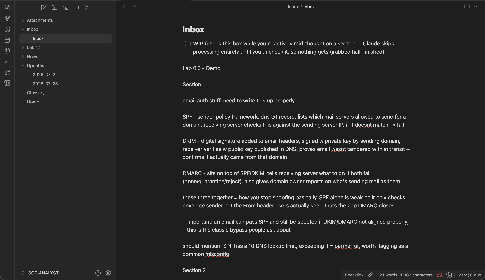
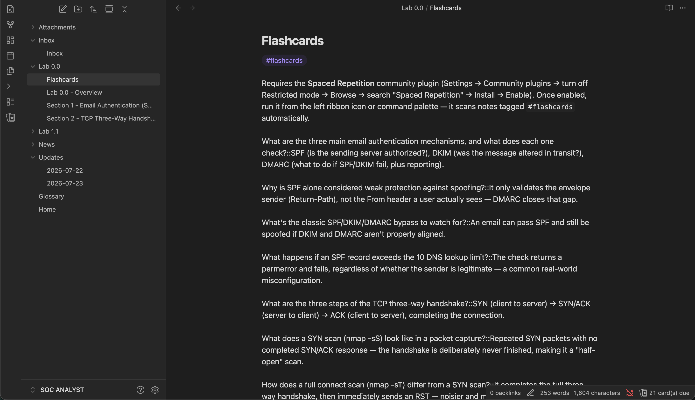
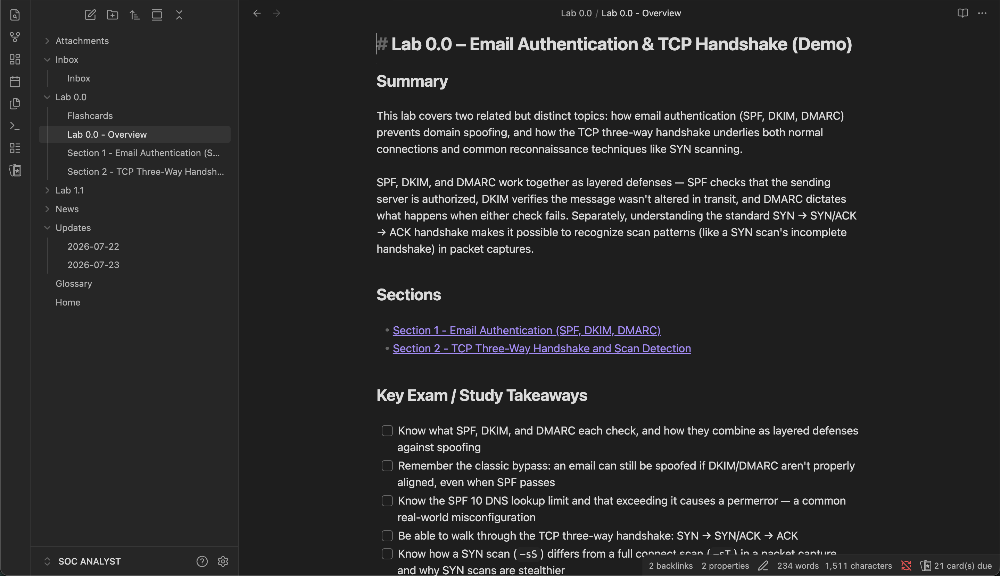
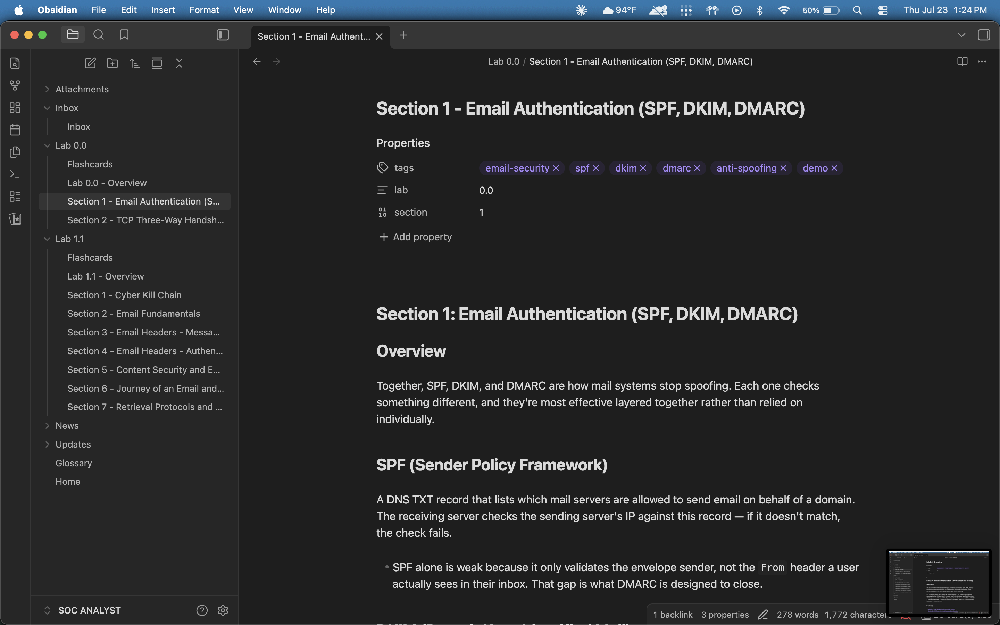
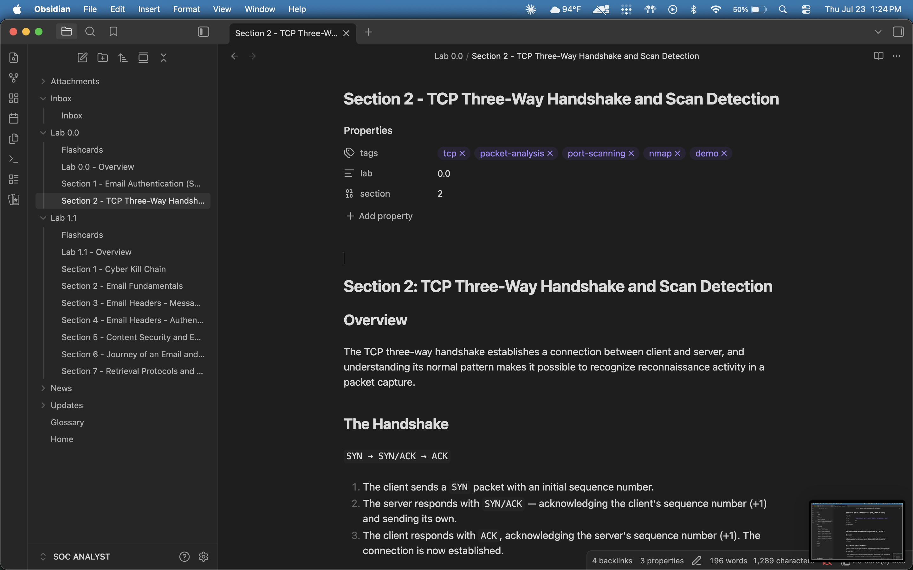

# Obsidian Inbox Autopilot

**Capture rough notes anywhere. Wake up to a clean, organized vault.**

A scheduled Claude task that watches a single Obsidian inbox note and files everything you drop into it (text and screenshots) into the right place in your vault. No app, no plugin, no server: just a plain-language instruction file that runs on a timer.

```
you write messy notes  →  Claude sorts, formats, and files them  →  vault stays organized
```

---

## Why this exists

Capturing a thought and organizing it properly are two different jobs, and they compete with each other. Stop to format and file something the moment you write it, and you lose your train of thought. Skip that step, and your notes pile up as fragments you'll never revisit.

This tool splits the two apart. Capture takes five seconds: drop a line into one inbox note. Organizing happens later, automatically, without you in the loop.

## What it does

| Step | Detail |
|---|---|
| **You capture** | Write rough notes, or paste a screenshot, into a single `Inbox.md` file, whenever, in whatever order. |
| **Claude sorts** | On a schedule (e.g. hourly), Claude reads the inbox, works out which note each piece belongs to, and reformats it to match your vault's existing style. |
| **Claude files** | New content is merged into the right note, creating it if it doesn't exist yet, appending to it if it does. Nothing gets overwritten. |
| **Claude tidies up** | Related terms get added to a running glossary. Key facts get turned into spaced-repetition flashcards. The inbox resets to empty. |
| **Claude reports** | Every run that changes something logs exactly what, to a dated changelog, so nothing happens invisibly. |

If the inbox is empty, the run does nothing and says nothing. Most runs are no-ops, by design.

## Features

- **One capture point.** Every note starts in the same place: `Inbox.md`. You never have to decide where something belongs while you're mid-thought.
- **Structure-aware filing.** Claude detects which section of your vault a note belongs to from context, and matches your existing formatting conventions rather than imposing its own.
- **Screenshot handling.** Paste an image into your inbox and it lands in the right note automatically. Anything Claude can't confidently place gets flagged, never silently dropped.
- **A glossary that keeps itself current.** New terms introduced in your notes get added automatically, each linked back to where they're covered.
- **Spaced-repetition flashcards.** Key facts and distinctions become `Question::Answer` cards, compatible with Obsidian's Spaced Repetition plugin, appended without touching your existing review history.
- **Additive, never destructive.** Notes accumulate across runs. Adding more to a topic tomorrow merges into today's note instead of duplicating or overwriting it.
- **A "still drafting" flag.** Check one box at the top of the inbox and Claude skips the note entirely until you uncheck it, so nothing gets filed half-finished.
- **A full paper trail.** Every change is logged with a timestamp, so you can see exactly what Claude did and when.

## How it works

There's no background service and nothing installed on your machine beyond Obsidian itself. `SKILL.md` in this repo is the entire implementation, a plain-language prompt that Claude runs on a recurring schedule against your locally connected vault folder. Each run:

1. Checks the inbox for a "WIP" flag and stops immediately if you're still drafting.
2. Does nothing if the inbox is empty (the common case).
3. Parses the rough notes for structure: which note they belong to, any images.
4. Creates or merges the corresponding notes, following your vault's existing conventions.
5. Updates the glossary and flashcards with anything new.
6. Resets the inbox to its empty template.
7. Logs what changed.

```
Your Vault/
├── Inbox/
│   └── Inbox.md              ← you write rough notes here
├── Unit 1.1/
│   ├── Unit 1.1 - Overview.md
│   ├── Section 1 - <Title>.md
│   ├── Section 2 - <Title>.md
│   └── Flashcards.md
├── Glossary.md
├── Attachments/               ← pasted/dropped screenshots
└── Updates/
    └── 2026-07-23.md          ← changelog
```

## Screenshots

**Before: rough notes in the Inbox**



**After: filed into clean, formatted notes**









## Setup

**Requirements:** [Claude](https://claude.ai) with Cowork/scheduled tasks, a local folder connected to your Claude desktop app, and an [Obsidian](https://obsidian.md) vault.

1. **Set up your vault structure.** At your vault root, create an `Inbox/` folder with an `Inbox.md` file, a `Glossary.md`, and an `Attachments/` folder. A starting template for `Inbox.md` is in [`examples/Inbox.md`](./examples/Inbox.md).

2. **Fill in the template.** Copy [`SKILL.md`](./SKILL.md) and replace the placeholders:

   | Placeholder | Example |
   |---|---|
   | `{{VAULT_NAME}}` | `Study Vault` |
   | `{{VAULT_PATH}}` | `/Users/you/Documents/Study Vault` |
   | `{{OWNER_NAME}}` | your name |
   | `{{UNIT_LABEL}}` | `Course`, `Project`, `Lab`, `Topic` (whatever your vault is organized around) |

3. **Create the scheduled task.** In Claude, connect your vault folder and create a scheduled task (e.g. hourly) using your filled-in `SKILL.md` as the prompt.

4. **Start capturing.** Drop rough notes and screenshots into `Inbox.md` throughout the day. The next scheduled run files everything.

An example changelog entry is in [`examples/Updates-example.md`](./examples/Updates-example.md).

## A note on file access

Only connect the specific vault folder this task needs, not your whole Documents folder or home directory. Scoping access narrowly limits what an automated task can reach if anything ever behaves unexpectedly, and it costs nothing to set up correctly the first time. See Anthropic's [guidance on using Cowork safely](https://support.claude.com/en/articles/13364135-use-claude-cowork-safely) for the full picture, particularly the section on scheduled tasks.

## Customizing

`SKILL.md` is plain language, not code. Every rule in it (formatting style, glossary conventions, flashcard format, how notes are detected) is editable. Treat the version in this repo as a working example, not a spec: adjust it to match how you actually organize your own vault.

## License

MIT. See [LICENSE](./LICENSE).
